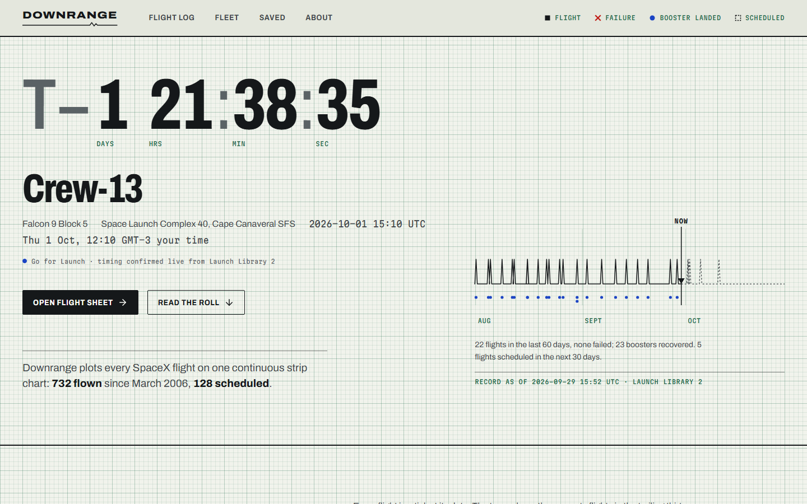
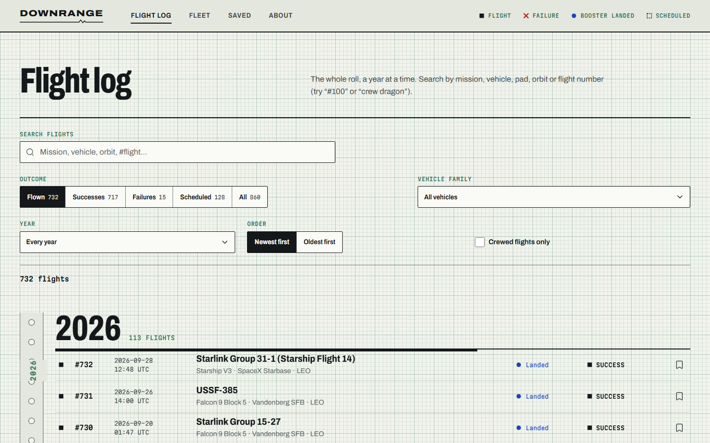
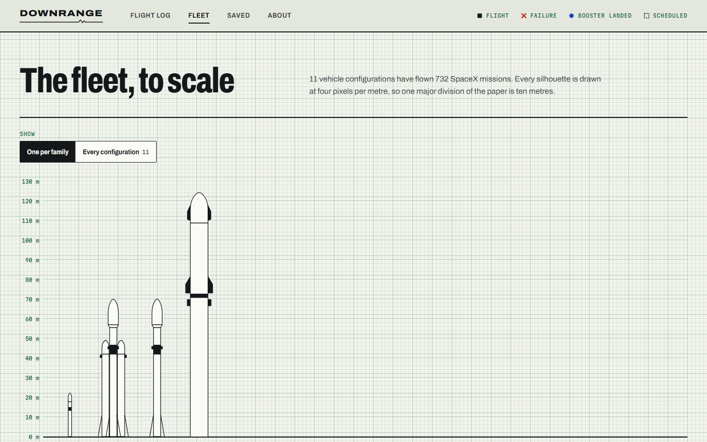
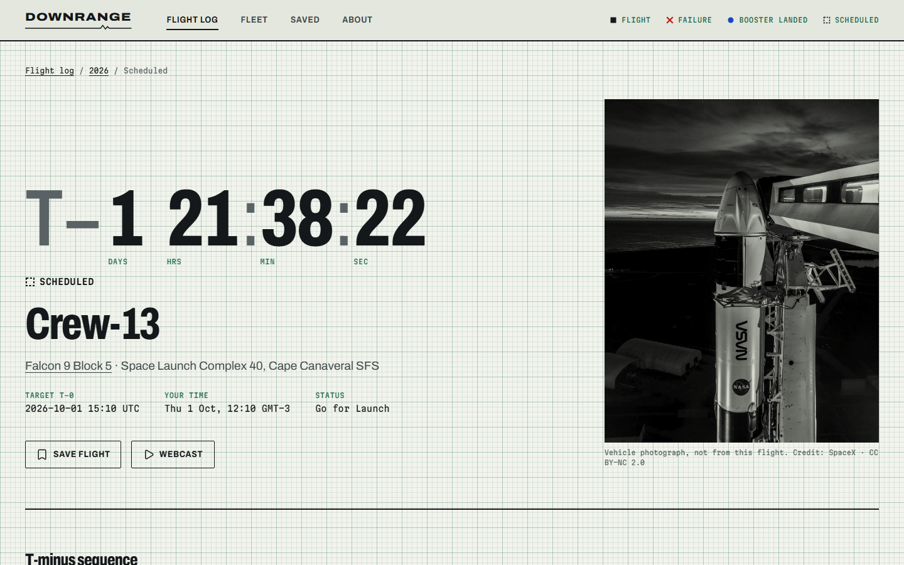
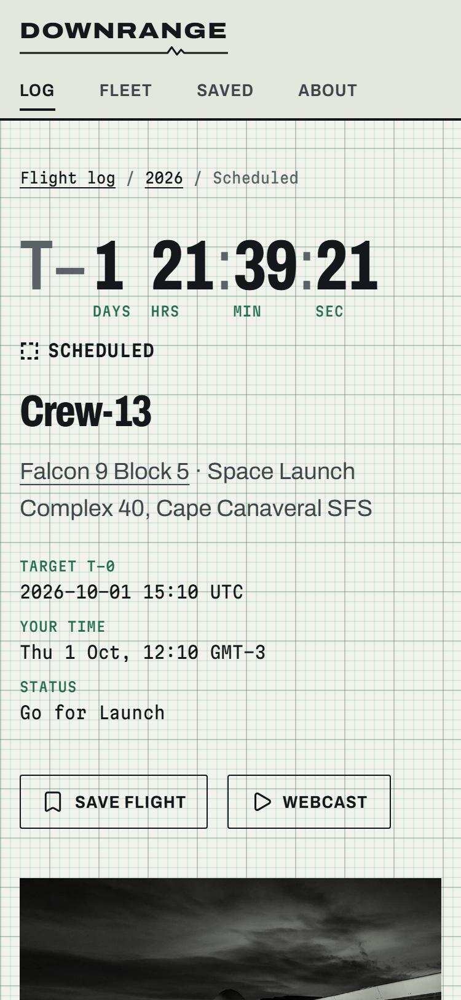

# Downrange

**The SpaceX flight record, drawn as a strip chart.** An unofficial explorer of every SpaceX launch since 2006: the next flight counting down at the pen head, two decades of cadence on one continuous roll, every flight's real T‑minus sequence, booster reuse, and the whole fleet drawn to scale.



> Downrange is an independent portfolio project. It is not affiliated with, endorsed by or connected to Space Exploration Technologies Corp. (SpaceX).

## The idea

Space sites tend to look alike: a starfield, a hero photo, a grid of equal cards. Downrange treats the record as what it is, telemetry, and draws it the way a strip‑chart recorder would: pens writing onto a roll of printed graph paper. Each ink has one meaning (carbon for flights, cobalt for booster landings, red only for failures, dashed for anything not yet flown), and the paper's grid is a real measuring scale.

| | |
|---|---|
|  |  |
| **Flight log**: every flight, searchable, filters in the URL | **Fleet**: 4 px per metre, so one grid division is ten metres |
|  |  |
| **Flight sheet**: a page torn off the roll at T‑0 | **Mobile**: charts change form instead of shrinking |

## Features

- **Next launch, live.** One request to Launch Library 2 confirms the next launch's timing; if it fails, the daily snapshot is used and the page says which. Dates print only as precisely as they are known: a "Q4 2026" flight never gets a fake countdown.
- **Two decades on one roll.** Every flight as a tick at its date, a trailing 30‑day cadence trace above them, landings below. Narrow screens get the same record stacked a year per row.
- **Flight log.** Full-text search (mission, vehicle, pad, orbit, `#flight`), outcome, family, year and crew filters, sort order. Everything lives in the URL, so any view is shareable and the back button retraces it.
- **Flight sheets.** Outcome, what went wrong on failures, the real countdown sequence plotted on a square‑root time axis, boosters with flight counts, turnaround and landing, crew, payloads, pad coordinates, webcasts.
- **Fleet to scale.** Silhouettes computed from each vehicle's recorded length and diameter, with a full specification and record table.
- **Saved flights.** Bookmarks kept in the browser (ids only), sortable A–Z / Z–A / by date, migrated automatically from the previous version of the app.

## Data source and its limits

The previous version read the community SpaceX API, which went offline in 2026 after freezing its data in October 2022. Downrange now uses [Launch Library 2](https://thespacedevs.com/llapi) by The Space Devs ([ADR 0001](docs/adr/0001-data-source.md)):

- `npm run sync` downloads the full SpaceX record (9 requests, inside LL2's 15/hour anonymous limit) and normalizes it into the app's own types under `public/data/`. A [daily GitHub Action](.github/workflows/sync-data.yml) commits changes, which redeploys the site.
- The browser makes one live call (the next launch), cached for 10 minutes. In local development it is off unless `VITE_LIVE=1`.
- Every figure on the site is computed from the snapshot; the snapshot date is printed on the home page and in the footer.
- Known limits: scheduled dates can lag a slip by up to a day; some photographs show the vehicle rather than the flight (labelled as such); photographs are LL2's originals, which makes image-heavy pages slower on mobile.
- Old `/launcher/:id` links and saved favourites map to the new record through `src/data/legacy-ids.json` (191 of 205 legacy ids; the rest redirect to the flight log).

## Stack

| Concern | Choice |
|---|---|
| Build | Vite 8, TypeScript 6 (strict) |
| UI | React 19, CSS Modules + design tokens as custom properties ([ADR 0002](docs/adr/0002-styling.md)) |
| Routing | React Router 7 data router, lazy route modules, loader prefetching |
| Data | TanStack Query 5 over typed services ([ADR 0003](docs/adr/0003-typescript-and-data-layer.md)) |
| Motion | Motion (`motion/react`), lazily loaded features, `prefers-reduced-motion` respected |
| Icons / type | lucide-react; Archivo and Martian Mono variable fonts, self-hosted |
| Quality | ESLint 9 (typescript-eslint, react-hooks, jsx-a11y), Prettier, Vitest + Testing Library |

ESLint stays on v9 because `eslint-plugin-jsx-a11y` does not yet support v10, and accessibility linting mattered more than the newest major.

## Getting started

Requires Node.js 22.18 or later.

```bash
git clone https://github.com/FelipeJuaneda/SpaceX.git
cd SpaceX
npm ci
npm run dev
```

| Script | What it does |
|---|---|
| `npm run dev` | Development server |
| `npm run build` | Type-check and production build |
| `npm run preview` | Serve the production build |
| `npm test` | Unit and integration tests (Vitest) |
| `npm run lint` / `npm run typecheck` / `npm run format` | Static checks and formatting |
| `npm run sync` | Refresh the launch snapshot from Launch Library 2 |
| `npm run sync:offline` | Rebuild the snapshot from the local cache in `.cache/ll2` |

Set `VITE_LIVE=1` to enable the live next-launch request during development. When deploying, point the `og:image` tag in `index.html` at the absolute URL of `/og.png` for link previews.

## Architecture

```
scripts/            sync-data.ts, normalize.ts, ll2-types.ts, build-legacy-map.ts
public/data/        the generated snapshot: launches.json, launches/<slug>.json, rockets.json, meta.json
src/
  app/              App, router, root layout, query client, route focus management, error boundary
  routes/           one folder per page (home, launches, launch, rockets, rocket, saved, about, not-found, legacy)
  features/
    launches/       queries, URL filters, selectors (statistics), next launch, FlightRow
    countdown/      T-minus clock
    rockets/        silhouettes, scale chart, spec table
    saved/          saved-flights store (useSyncExternalStore) and save button
  components/
    chart/          recent trace, roll chart, reuse chart, T-minus sequence, pen legend
    ui/             button, choice keys, search field, select, readout, photo, skeleton, state messages
    layout/         masthead, footer, page metadata
  services/         http, snapshot and live Launch Library 2 clients
  lib/              formatting, LL2 → domain mapping (shared with the sync script)
  styles/           tokens.css, global.css
  types/domain.ts   the only data shapes the UI knows
```

## Design decisions

- **[DESIGN.md](DESIGN.md)**: the built design system (tokens, typography, rules, components).
- **[docs/design/directions.md](docs/design/directions.md)**: how the strip-chart direction was chosen over six alternatives.
- **[PRODUCT.md](PRODUCT.md)**: users, purpose and principles.
- **[docs/PLAN.md](docs/PLAN.md)**: the phased plan and announced behaviour changes.

Three rules shape everything: one ink, one meaning; nothing encoded by colour alone; every number computed from the data and dated.

## Accessibility and performance

- WCAG 2.2 AA: keyboard access everywhere, visible focus, 44 px targets, labelled controls, focus moved to the page on navigation, text alternatives (lists and tables) for every chart, `prefers-reduced-motion` renders charts fully drawn.
- Lighthouse, mobile, production build: Accessibility 100, Best Practices 100 and SEO 100 on every page tested; Performance 89–91 on the home, log, fleet, saved and about pages, with zero layout shift. Flight sheets score around 80 because their largest element is Launch Library 2's full-resolution photograph.
- Code splitting per route, lazy animation features and toasts, preloaded fonts and data.

## Testing

`npm test` runs 52 tests: LL2 mapping, date and precision formatting, URL filters, statistics, the saved-flights store (including migration from the old favourites), and integration tests of the flight log, flight sheet and saved flights with search, filters in the URL, empty, not-found and retry states.

## Credits

Launch data from [Launch Library 2](https://thespacedevs.com/llapi) by The Space Devs. Photographs belong to their credited authors and are shown with the credit and licence the source provides. Built by [Felipe Juaneda](https://github.com/FelipeJuaneda).
